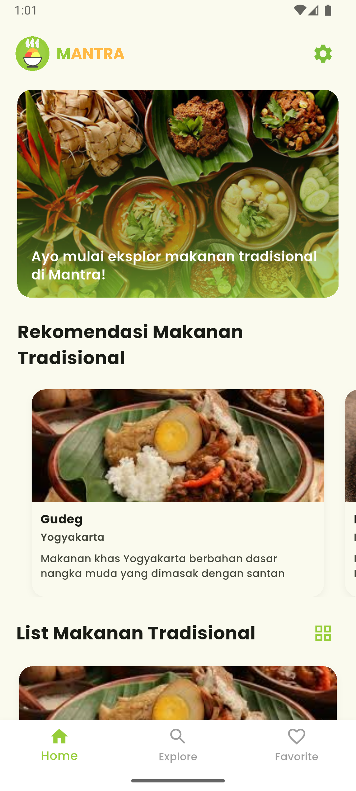
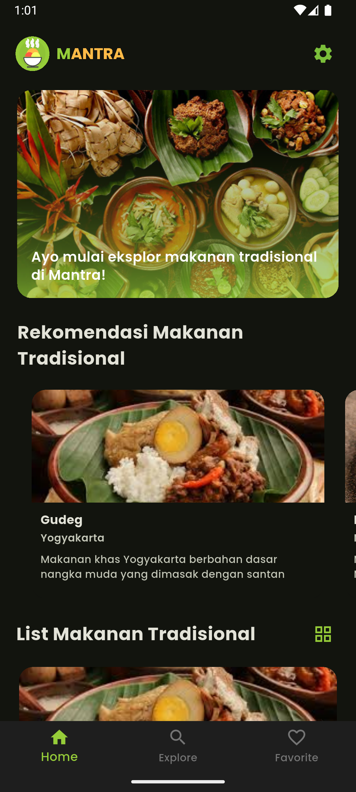
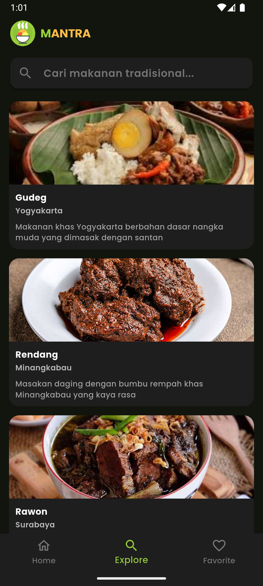
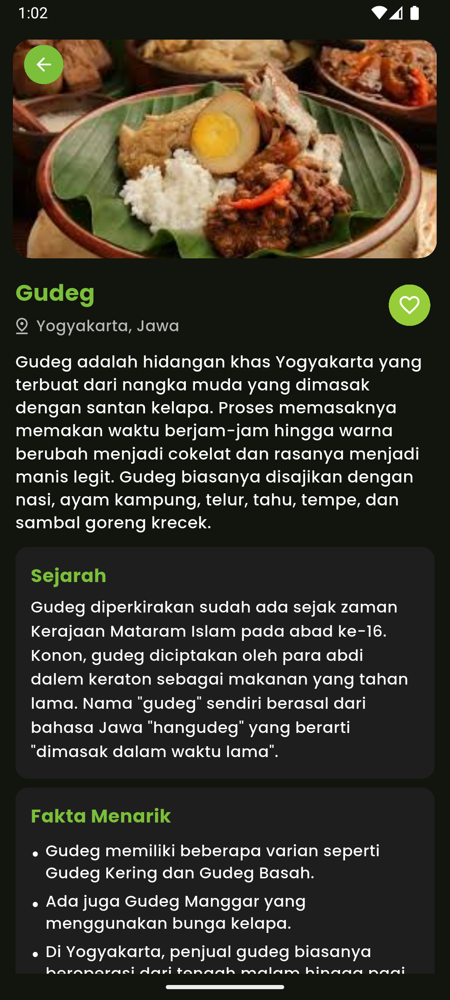

# 🍜 Mantra - Aplikasi Kuliner Tradisional Indonesia

<div align="center">
  
  
  <p align="center">
    Aplikasi mobile Flutter untuk mendokumentasikan kuliner tradisional Indonesia dengan foto, deskripsi, dan cerita asal-usulnya.
  </p>


</div>

---

## 📖 Tentang Aplikasi

**Mantra** adalah aplikasi mobile berbasis Flutter yang bertujuan untuk mendokumentasikan dan memperkenalkan kembali kuliner tradisional Indonesia kepada generasi muda. Aplikasi ini menyajikan daftar makanan khas dari berbagai daerah, dilengkapi dengan foto, deskripsi, serta cerita asal-usulnya.

### 🎯 Tujuan

- Melestarikan kuliner tradisional Indonesia
- Memperkenalkan kembali makanan daerah kepada generasi muda
- Menyediakan platform digital yang mudah diakses
- Mendukung ekonomi lokal dan pariwisata berkelanjutan

---

## ✨ Fitur Utama

### 🏠 Home

- Banner promosi makanan tradisional
- Rekomendasi makanan pilihan
- List lengkap makanan tradisional dari berbagai daerah
- Toggle view: List atau Grid view

### 🔍 Explore

- Search makanan berdasarkan nama atau daerah
- Filter makanan berdasarkan kategori
- Debounced search untuk performa optimal

### ❤️ Favorite

- Simpan makanan favorit
- Akses cepat ke makanan yang disukai
- Persistent storage menggunakan Provider

### 📝 Detail Makanan

Setiap makanan memiliki informasi lengkap:

- 📸 **Foto Utama** - Gambar berkualitas tinggi
- 📍 **Asal Daerah** - Informasi regional (provinsi dan pulau)
- 📝 **Deskripsi Lengkap** - Penjelasan detail tentang makanan
- 📜 **Sejarah** - Cerita asal-usul dan latar belakang
- ✨ **Fakta Menarik** - Informasi unik dalam bentuk bullet points
- 🖼️ **Galeri Foto** - Koleksi foto tambahan dengan pagination

### ⚙️ Settings

- **Dark/Light Mode** - Toggle tema dengan persistent storage
- **Tentang Aplikasi** - Informasi aplikasi dan versi
- Responsive design untuk portrait dan landscape

---

## 🛠️ Teknologi yang Digunakan

### Frontend (Mobile)

- **Flutter** `^3.9.2` - Framework cross-platform
- **Dart** - Programming language
- **Provider** `^6.1.5` - State management
- **Material Design 3** - UI design system

### Packages & Dependencies

```yaml
dependencies:
  provider: ^6.1.5+1 # State management
  http: ^1.5.0 # HTTP requests
  shared_preferences: ^2.5.3 # Local storage
  package_info_plus: ^8.0.0 # App info
  flutter_svg: ^2.2.1 # SVG rendering
  cached_network_image: ^3.4.1 # Image caching
  flutter_dotenv: ^6.0.0 # Environment variables
```

### Backend

- **REST API** - Custom-built API untuk data kuliner
- **Environment Variables** - Konfigurasi dengan `.env` file

---

## 📱 Screenshots

<div align="center">
  
  
  
  
</div>


---

## 🚀 Instalasi & Setup

### Prerequisites

- Flutter SDK `^3.9.2` atau lebih baru
- Dart SDK `^3.0`
- Android Studio / VS Code
- Android Emulator atau iOS Simulator

### Langkah Instalasi

1. **Clone Repository**

   ```bash
   git clone https://github.com/BEKUP-Create-2025-B25-PG020/Frontend-Flutter.git
   cd mantra-application
   ```

2. **Install Dependencies**

   ```bash
   flutter pub get
   ```

3. **Setup Environment Variables**

   Buat file `.env` di root project:

   ```env
   API_KEY=yout_api_key
   BASE_URL=your_api_base_url_here
   ```

4. **Run Application**

   ```bash
   # Run di debug mode
   flutter run

   # Run di release mode
   flutter run --release
   ```

### Build APK/IPA

```bash
# Build APK (Android)
flutter build apk --release

# Build App Bundle (Android)
flutter build appbundle --release

# Build iOS
flutter build ios --release
```

---

## 📁 Struktur Project

```
lib/
├── common/
│   ├── provider/          # Global providers
│   │   ├── index_nav_provider.dart
│   │   └── theme_provider.dart
│   ├── screen/            # Shared screens
│   ├── static/            # Constants & enums
│   ├── style/             # Theme & styling
│   │   ├── colors/
│   │   ├── theme/
│   │   └── typography/
│   └── widgets/           # Reusable widgets
│
├── core/
│   └── data/
│       ├── model/         # Data models
│       ├── response/      # API response models
│       └── service/       # HTTP service
│
├── feature/
│   ├── detail/            # Detail screen
│   ├── explore/           # Explore screen
│   ├── favorite/          # Favorite screen
│   ├── home/              # Home screen
│   ├── settings/          # Settings feature
│   │   └── screen/
│   │       ├── settings_screen.dart
│   │       └── about_screen.dart
│   ├── provider/          # Feature-specific providers
│   └── widgets/           # Feature-specific widgets
│
└── main.dart              # Entry point
```

---

## 🎨 Fitur Theme

Aplikasi mendukung **Dark Mode** dan **Light Mode** dengan:

- ✅ Persistent theme selection (tersimpan di local storage)
- ✅ Smooth transition antar theme
- ✅ Semua screen mendukung kedua mode
- ✅ Custom color scheme dengan Material Design 3

### Toggle Theme

Settings → Switch theme

---

## 🔌 API Integration

Aplikasi menggunakan REST API untuk mengambil data kuliner tradisional Indonesia.

### Backend Repository
Dokumentasi lengkap backend dan API dapat dilihat di:  
🔗 [Mantra Backend Repository](https://github.com/BEKUP-Create-2025-B25-PG020/backend.git)


### Base Configuration

```dart
// Setup di .env
BASE_URL=https://mantra.aerossky.com/
```

### Endpoints yang Digunakan

- `GET /foods` - Mendapatkan list semua makanan
- `GET /foods/:id` - Mendapatkan detail makanan
- `GET /foods/featured` - Mendapatkan makanan unggulan

---

## 👥 Kontributor

- **Muhammad Azra** - _Developer_ - [GitHub](https://github.com/muhammadazra4503)
- **Gulamin Halim Toyoki Siregar** - _Developer_ - [GitHub](https://github.com/GulaminHalim)
- **Risky** - _Developer_ - [GitHub](https://github.com/Aerossky)
- **Saeful Ammar** - _Developer_ - [GitHub](https://github.com/yourusername)

Ingin berkontribusi? Pull requests are welcome! Untuk perubahan besar, silakan buka issue terlebih dahulu.

---

## 📝 License

Project ini menggunakan [MIT License](LICENSE).

---

## 🙏 Acknowledgments

- Data kuliner tradisional Indonesia
- Flutter community
- Material Design guidelines
- Open source contributors

---

<div align="center">
  <p>Dibuat dengan ❤️ untuk melestarikan kuliner tradisional Indonesia</p>
  <p>© 2025 Mantra. All rights reserved.</p>
</div>
```
